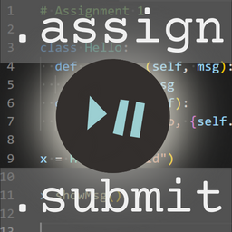

# LectureAssign

Visual Studio Code extension
by LectureDot 🎓•

Latest version (click to download): [LectureAssign v0.1.4](vsix/lecture-assign-0.1.4.vsix) - 2024-04-18  
Installation instructions [below](#installation).

----

Create, track, and review coding assignments.

The purpose of this extension is to reduce plagiarism and streamline coding assignment creation and submission.

WARNING: LectureAssign is still in beta.

If you have any issues or suggestions, please add them here: 
[Issues and Suggestions](https://github.com/LectureDot/LectureAssign-vscode/issues).

----

## Installation

While the extension is still in beta, it is not available in the VSCode marketplace.

To install this extension:

- Download the latest version of the LectureAssign extension.
- Open Visual Studio Code
- Pull down the **Help** menu, and click **Show All Commands**
- Type in "VSIX"
- Click **Extensions: Install from VSIX...**
- Locate the downloaded file **vsix** file, and click **Install**.

You may see a message (bottom-right) "Completed installing Lecture Assign extension from VSIX. Please reload Visual Studio Code to enable it." with a button **Reload Now**.  
If so:

- Click the **Reload Now** button.

----

## LectureAssign Version History

### [0.1.4](vsix/lecture-assign-0.1.4.vsix) - 2024-04-18

#### Added

- Command added to change default path (and default path prompt removed when starting assignment)
- All submission files added to temp folder at time of viewing (as opposed to one at a time)
- Temporary folders removed when extension closes

#### Fixed

- Fixed default path issues

### [0.1.3](vsix/lecture-assign-0.1.3.vsix) - 2024-04-12

#### Fixed

- Making sure paths exist when updating assignment view and when starting assignment

### [0.1.2](vsix/lecture-assign-0.1.2.vsix) - 2024-04-04

#### Fixed

- New UUID given to assignment file every time instructor edits it
- Fixed bug where submission could not be created if placeholder for a file did not have content
- Fixed bug when importing new content to overwrite existing content
- Regular updates to modified date/time in assignment view

### [0.1.1](vsix/lecture-assign-0.1.1.vsix) - 2024-03-24

#### Fixed

- Fixed bug where files collected via file-pattern would be duplicates of those in the submission
- Fixed bug where in instructor-editing mode field changes got lost when attached file content was updated
- Fixed bug where in submission view changing between two file replays would retain the same content preview

### [0.1.0](vsix/lecture-assign-0.1.0.vsix) - 2024-03-17

#### Added

- Assignment creation and editing
- UUID for both assignments and submissions
- Version requirement checking
- Binary file attachments
- Instructor and student abilities to rename files and change descriptions
- Extra file bundling into submissions via file patterns
- Saving playback/chart settings when .submit file tabs change
- Saving time-based playback setting

#### Fixed

- Fixed bug where rewinding to beginning in the middle of playback caused an error

### [0.0.18](vsix/lecture-assign-0.0.18.vsix) - 2024-02-15

#### Fixed

- Fixed bug where long horizontal lines in submission content replay were causing assignment information to disappear

### [0.0.17](vsix/lecture-assign-0.0.17.vsix) - 2024-02-13

#### Added

- Time-based replay
- Saving replay speed preferences

#### Fixed

- Minor bug fixes
- Removed .track files from file explorer

### [0.0.16](vsix/lecture-assign-0.0.16.vsix) - 2024-02-02

- First stable release